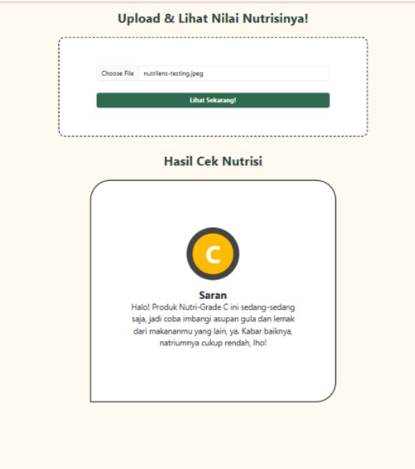

# 🍽️ NutriLens Frontend


## 🚀 Live Demo

🔗 https://nutrilens-weld.vercel.app/

---

## 📌 Overview

**NutriLens** adalah aplikasi berbasis web yang membantu pengguna mengetahui grade nutrisi dari makanan dan minuman mereka.

---

## ✨ Features

- 🔍 Tampilan upload foto makanan
- 📋 Informasi hasil analisis makanan

---

## 📸 Screenshots

### 🏠 Home Page

Tampilan utama dengan desain sederhana untuk memudahkan user memulai proses.

<p align="center">
  
</p>

---

### 🔍 Scan Result

Menampilkan hasil analisis makanan dengan indikator yang jelas.

<p align="center">
  
</p>

---

## 🛠️ Tech Stack

| Technology   | Description                           |
| ------------ | ------------------------------------- |
| ⚛️ React     | Library untuk membangun UI interaktif |
| ⚡ Vite      | Build tool untuk development cepat    |
| 🎨 Bootstrap | Framework styling                     |
| ▲ Vercel     | Deployment platform                   |

---

## ⚙️ Installation & Setup

Clone repository :

```bash
git clone https://github.com/dafaernd/Nutrilens-Front-End.git
cd nutrilens-fe
```

Install depedencies:

```bash
npm install
```

Run project:

```bash
npm run dev
```
